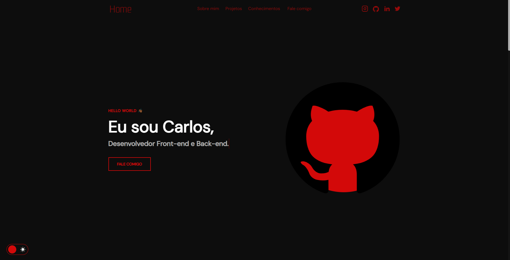

<h1 align="center">Currículo/Portifólio interativo - Carlos  Bearzotti</h1>

<h4 align="center"><a href="https://curriculo-lemon-mu.vercel.app">Veja o Projeto</a></h4>

---

## 💻 Sobre

Projeto feito no intuito de refinar meus conhecimentos em Front-End

## 🧠 Tecnologias utilizadas:

O site continuara a receber atualizações de projetos e currículo. Tecnologias utilizadas:

    
    
    

---

<table>
  <tr>
    <td>
      
    <td>
      Feito por <a href="https://github.com/carlosbearzotti">Carlos Eduardo Bearzotti da Silva.</a>
    </td>
  </tr>
</table>